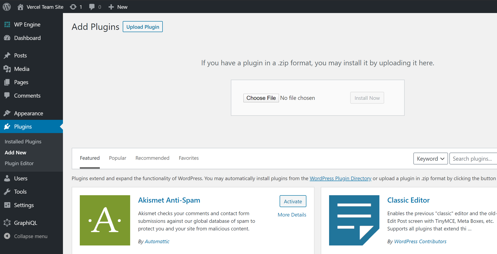
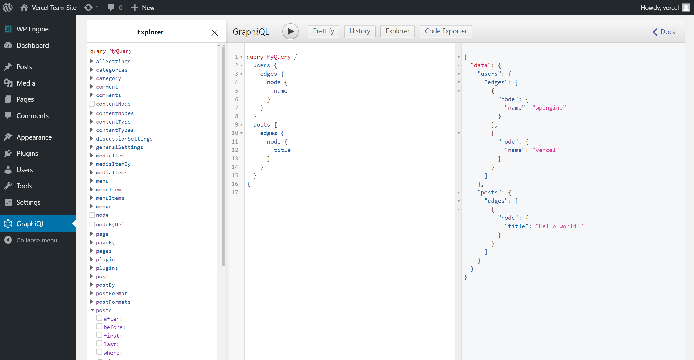

# A statically generated blog example using Next.js and WordPress

This example showcases Next.js's [Static Generation](https://nextjs.org/docs/basic-features/pages) feature using [WordPress](https://wordpress.org) as the data source.

## Demo

### [sdgs-website.vercel.app](sdgs-website.vercel.app)

## Configuration

### Step 1. Prepare your WordPress site

First, you need a WordPress site. There are many solutions for WordPress hosting, such as [WP Engine](https://wpengine.com/) and [WordPress.com](https://wordpress.com/).

Once the site is ready, you'll need to install the [WPGraphQL](https://www.wpgraphql.com/) plugin. It will add GraphQL API to your WordPress site, which we'll use to query the posts. Follow these steps to install it:

- Download the [WPGraphQL repo](https://github.com/wp-graphql/wp-graphql) as a ZIP archive ( WPGraphQL **Version 1.8.0** is used in for this project and thus the qraphQL query is refactored to meet plugin query ).
- Inside your WordPress admin, go to **Plugins** and then click **Add New**.


- Click the **Upload Plugin** button at the top of the page and upload the WPGraphQL plugin.



- Once the plugin has been added, activate it from either the **Activate Plugin** button displayed after uploading or from the **Plugins** page.


#### GraphiQL

The [WPGraphQL](https://www.wpgraphql.com/) plugin also gives you access to a GraphQL IDE directly from your WordPress Admin, allowing you to inspect and play around with the GraphQL API.



### Step 2. Populate Content

Inside your WordPress admin, go to **Posts** and start adding new posts:

- We recommend creating at least **2 posts**
- Use dummy data for the content
- Pick an author from your WordPress users
- Add a **Featured Image**. You can download one from [Unsplash](https://unsplash.com/)
- Fill the **Excerpt** field


When you’re done, make sure to **Publish** the posts.

> **Note:** Only **published** posts and public fields will be rendered by the app unless [Preview Mode](https://nextjs.org/docs/advanced-features/preview-mode) is enabled.

### Step 3. Set up environment variables

Copy the `.env.local.example` file in this directory to `.env.local` (which will be ignored by Git):

```bash
cp .env.local.example .env.local
```

Then open `.env.local` and set `WORDPRESS_API_URL` to be the URL to your GraphQL endpoint in WordPress. For example: `https://myapp.wpengine.com/graphql`.

Your `.env.local` file should look like this:

```bash
WORDPRESS_API_URL=...

# Only required if you want to enable preview mode
# WORDPRESS_AUTH_REFRESH_TOKEN=
# WORDPRESS_PREVIEW_SECRET=
```

### Step 4. Run Next.js in development mode

```bash
npm install
npm run dev

# or

yarn install
yarn dev
```

Your blog should be up and running on [http://localhost:3000](http://localhost:3000)! If it doesn't work, post on [GitHub discussions](https://github.com/vercel/next.js/discussions).


## React 18 useEffect issue

Check out tread [](https://github.com/vercel/next.js/issues/35822)

## Icons used
[heroicons by tailwind](https://heroicons.com/)

## Lottie Animation
[lottiefiles](https://lottiefiles.com/)
[lottie-react](https://github.com/LottieFiles/lottie-react)
